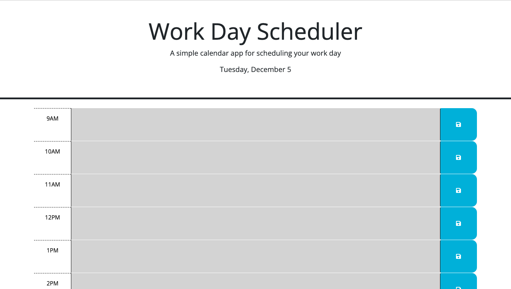

# Work Day Scheduler

## Description

A simple calendar application that allows a user to save events for each hour of a typical working day (9am - 5pm) by modifying starter code. This app will run in the browser and feature dynamically updated HTML and CSS powered by jQuery.

# Installation
N/A

# Usage

View application by clicking here: LINK

# License

# Features

# In-App Features
* Timeblocks from 9am to 5pm
    * These chosen timeblocks are to represent an average work day.
    * The timeblocks are dynamic and will color cordinated by gray, red, and green. 
    * Timeblocks in gray represent the hours that have already passed. Timeblock in red represents the current hour. Timeblock in green are upcoming hours.

* Users can enter new events into the scheduler.
    * Events entred into the chosed timeblock will be saved to a local storage. 

## Tests
Utilized VS Code and Console Log